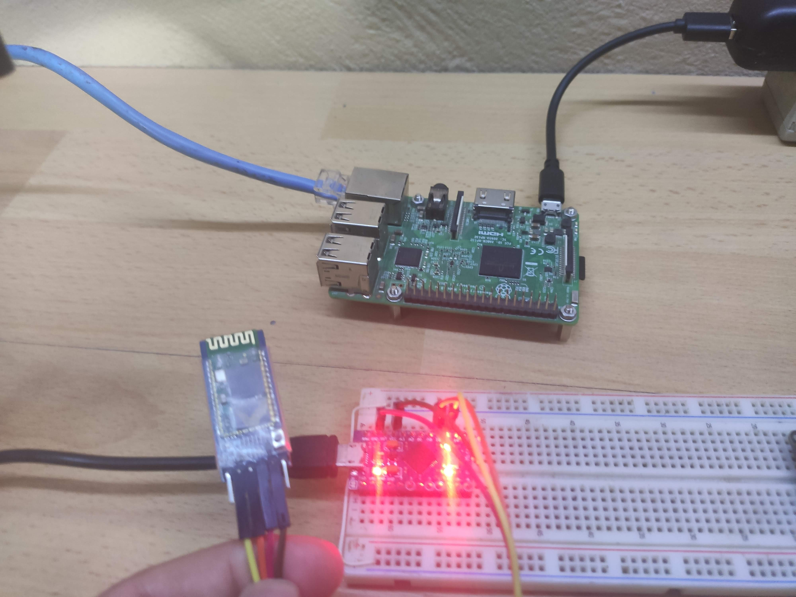
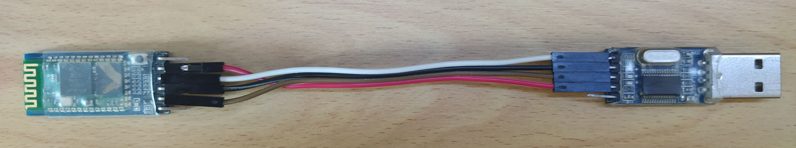
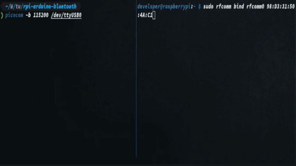
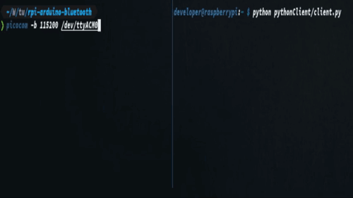

# Basic connection between arduino and raspberry pi through Bluetooth



## The hardware
  - Raspberry pi 3b+ (it has inbuilt Bluetooth)
  - Arduino micro
  - HC-05 Bluetooth module

## System requirements
  - arduino-cli
  - picocom
  - python 3

## Configurations for Bluetooth module HC-05
  - Configure the module as master
  - Set PIN

## Configurations for Raspberry Pi
  - [Install and configure raspbian](https://github.com/ivanmorenoj/arduino-wifi-connection/blob/master/README.md#raspberry-pi-setup)
  - [Configure python3 as default python interpreter](https://github.com/ivanmorenoj/arduino-wifi-connection/blob/master/README.md#raspberry-pi-setup)
  - Install Bluetooth packages
  - Pair with HC-05 module
  - Copy Bluetooth code

## Configurations for arduino
  - Install avr boards
  - Make physical connections
  - Copy arduino code and upload to arduino board

# HC-05 Setup

First connect Bluetooth module to USB serial and press EN button, then send AT commands.

Test AT commands in serial port from USB to serial converter. The default baud rate for AT commands is 38400
```sh
$ echo -e "AT\r" | picocom -b 38400 -qrx 1000 /dev/ttyUSB0
OK
```
Set with AT commands
```sh
$ echo -e "AT+NAME=ARDUINOBT\r" | picocom -b 38400 -qrx 1000 /dev/ttyUSB0
OK
```
Set password
```sh
$ echo -e "AT+PSWD=1379\r" | picocom -b 38400 -qrx 1000 /dev/ttyUSB0
OK
```
Set default baud rate
```sh
$ echo -e "AT+UART=115200,1,0\r" | picocom -b 38400 -qrx 1000 /dev/ttyUSB0
OK
```
Disconnect and test settings

# Raspberry Pi Setup

Once installed raspbian and make the [basic configurations](https://github.com/ivanmorenoj/arduino-wifi-connection/blob/master/README.md#raspberry-pi-setup), install Bluetooth required packages. 

```sh
$ sudo apt install -y pi-bluetooth bluetooth bluez picocom blueman python3-pip
```

First edit Bluetooth service 
```sh
$ sudo vi /etc/systemd/system/dbus-org.bluez.service
```
Add the following lines
```
  ExecStart=/usr/lib/bluetooth/bluetoothd -C
  ExecStartPost=/usr/bin/sdptool add SP
```

Reload systemd units
```sh
$ sudo systemctl daemon-reload
```

Enable Bluetooth service
```sh
$ sudo systemctl enable --now bluetooth
```

Edit the next file to load rfcomm automatically 
```sh
$ sudo vi /etc/modules-load.d/modules.conf
```
Add the following line 
```
rfcomm
```
Reboot the system

## Pair with HC-05 module

Access to Bluetooth console
```sh
$ sudo bluetoothctl 
```

Pair with Bluetooth module 
```sh
[bluetooth]# agent on
[bluetooth]# scan on
  Discovery started
  [NEW] Device 98:D3:31:50:4A:C1 98-D3-31-50-4A-C1
  [CHG] Device 98:D3:31:50:4A:C1 LegacyPairing: no
  [CHG] Device 98:D3:31:50:4A:C1 Name: ARDUINOBT
  [CHG] Device 98:D3:31:50:4A:C1 Alias: ARDUINOBT

[bluetooth]# scan off
  [CHG] Controller B8:27:EB:80:2D:06 Discovering: no
  Discovery stopped

[bluetooth]# pair 98:D3:31:50:4A:C1
  Attempting to pair with 98:D3:31:50:4A:C1
  [CHG] Device 98:D3:31:50:4A:C1 Connected: yes
  Request PIN code
  [agent] Enter PIN code: 1379
  [CHG] Device 98:D3:31:50:4A:C1 UUIDs: 00001101-0000-1000-8000-00805f9b34fb
  [CHG] Device 98:D3:31:50:4A:C1 ServicesResolved: yes
  [CHG] Device 98:D3:31:50:4A:C1 Paired: yes
  Pairing successful
  [CHG] Device 98:D3:31:50:4A:C1 ServicesResolved: no
  [CHG] Device 98:D3:31:50:4A:C1 Connected: no

[bluetooth]# trust 98:D3:31:50:4A:C1
  [CHG] Device 98:D3:31:50:4A:C1 Trusted: yes
  Changing 98:D3:31:50:4A:C1 trust succeeded

[bluetooth]# exit
```

Create a serial device
```sh
$ sudo rfcomm bind rfcomm0 <device's MAC>
```

If everything works, connect with picocom and test communication in both sides


Install pyserial library for python3
```sh
$ sudo pip3 install pyserial
```
Copy pythonClient dir to raspberry pi and execute `client.py` script 
```sh
$ python pythonClient/client.py
```

# Arduino Setup

## Physical connections 
Connections for HC-05 module
  - GND -> GND Arduino
  - VCC -> VCC Arduino
  - RX  -> D14 Arduino
  - TX  -> D15 Arduino
  - EN  -> N/C

## Compile and upload the sketch 
Upload the code to arduino board, considering serial port of arduino micro is `/dev/ttyACM0`
```sh
$ arduino-cli compile -b arduino:avr:micro -u -p /dev/ttyACM0 ~/WorkSpace/tutorials/rpi-arduino-bluetooth/arduinoBT-HC05
```

# Test Communications


## Raspberry pi output example
```
developer@raspberrypi:~ $ python pythonClient/client.py
  Enter your message below.
  Insert "exit" to leave the application.
  You message >> hi from raspberry pi
  Server Response >> hi
  
  You message >> test connection
  Server Response >> test connection from arduino
  
  You message >> exit
```

## Arduino Output example 
```
$ picocom -b 115200 /dev/ttyACM0
  Terminal ready
  Server response: hi from raspberry pi
  You response -> hi
  Server response: test connection
  You response -> test connection from arduino
  
  Terminating...
  Skipping tty reset...
  Thanks for using picocom
```

